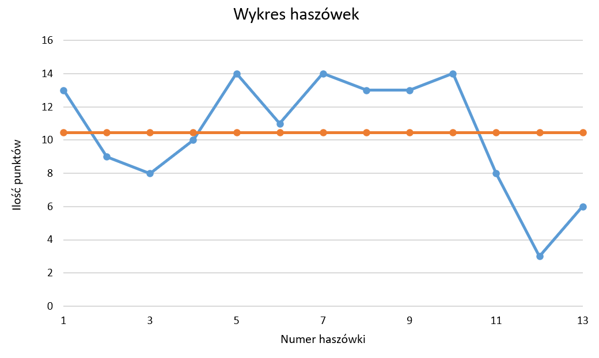

# Kurs SCR - Systemy operacyjne LAB , rok akademicki 2019/20 .

Moje wyniki haszówek

|  Nr | Wynik |
| :------------: | :------------: |
| 1  | 13  |
| 2  | 9  |
| 3  | 8  |
| 4  | 10  | 
| 5  | 14  | 
| 6  | 11  | 
| 7  | 14  | 
| 8  | 13  | 
| 9  | 13  | 
| 10  | 14  | 
| 11  | 8  | 
| 12  | 3  | 
| 13  | 6  | 

 [fig:my~l~abel]
